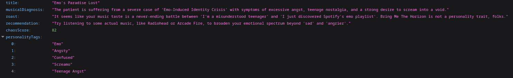

## Roast My Taste

Roast My Taste is a backend-only API that authenticates users using Spotify OAuth and generates humorous, sarcastic "roasts" about a user's music taste using an AI provider. The project is intended as a portfolio backend showcasing secure OAuth integration, external API consumption, and a small but maintainable architecture.

Key focus areas:
- OAuth2 login (Authorization Code Flow)
- Secure external API integration (Spotify)
- Token lifecycle handled by Spring Security
- Simple, testable and pragmatic architecture (no overengineering)

Features
--------
- Spotify OAuth2 Login (Authorization Code Flow)
- Automatic access token management via Spring Security
- Fetch user's top artists & tracks (user-top-read)
- AI-generated roast / analysis based on listening habits
- Debug endpoints for development and testing
- API-only (no frontend)

Tech stack
----------
- Java 25
- Spring Boot 4
- Spring Security OAuth2 Client
- Spring AI (ChatClient integration)
- Gradle

Authentication flow (high level)
--------------------------------
The application uses Spotify's Authorization Code Flow. Spring Security handles the OAuth code exchange and token lifecycle automatically. Typical sequence:

1. Client sends user to: GET /oauth2/authorization/spotify
2. User authenticates on Spotify and grants scopes
3. Spotify redirects to: {baseUrl}/login/oauth2/code/spotify
4. Spring Security exchanges the code for an access token and stores the authorized client
5. Controllers obtain the access token from the authorized client and call Spotify or AI providers

Setup
-----
1) Create a Spotify App

  - Open the Spotify Developer Dashboard and create an application.
  - Configure the Redirect URI for development (example):

	http://127.0.0.1:8080/login/oauth2/code/spotify

2) Configure environment variables

  - Define the following environment variables or system properties (example names used in `application.yml`):


	SPOTIFY_CLIENT_ID   (your Spotify client id)

	SPOTIFY_SECRET      (your Spotify client secret)

    GROQ_API_URL        (base URL for the AI provider, e.g. OpenAI API base url)

	GROQ_API_KEY        (API key for the configured AI provider)

  - Note: `application.yml` references `${GROQ_API_KEY}` for `spring.ai.openai.api-key` and a base URL for the AI provider. Adjust if you use a different provider.

3) Run the project

  ```bash
  ./gradlew bootRun
  ```

  Run with the `local` profile (uses `FakeAiAnalyzerProvider` instead of a real AI provider):

  ```bash
  ./gradlew bootRun -Dspring.profiles.active=local
  # or
  SPRING_PROFILES_ACTIVE=local ./gradlew bootRun
  ```

Endpoints (developer/debug)
---------------------------
- GET /oauth2/authorization/spotify  — start Spotify login
- GET /api/v1/analysis                — generate roast (debug) using the current user's authorized token
- GET /api/v1/debug/top-tracks        — return user's top tracks
- GET /api/v1/debug/top-artists       — return user's top artists
- GET /api/v1/debug/profile           — return constructed `UserProfile`
- GET /                                  — basic health/info endpoint
- GET /id                                — debug endpoint printing the client id loaded from config

Example AI Response:
----------------------


Domain / Response format
------------------------
The AI response is mapped to the Java record `RoastAnalysis` (see `src/main/java/.../domain/model/RoastAnalysis.java`) with these fields:

- title
- musicalDiagnosis
- roast
- recommendation
- chaosScore (0 - 100)
- personalityTags (List<String>)

Profiles and AI providers
-------------------------
- `FakeAiAnalyzerProvider` is active for `local` profile and returns a deterministic response for development.
- `SpringAiAnalyzerProvider` is active for non-local profiles and uses Spring's `ChatClient` to prompt an AI model. The system prompt includes rules to avoid hate speech and slurs and asks for a structured response.

Configuration notes
-------------------
- Important properties are in `src/main/resources/application.yml` (OAuth client registration, AI settings and base urls, Spotify API base url).
- OAuth scope required: `user-top-read` (already configured in `application.yml`).

Security and operational notes
------------------------------
- Never commit secrets (Spotify client secret, AI API key) to source control.
- Use a secure secret storage on production (Vault, cloud secret manager, CI secrets).
- Spotify enforces rate limits — handle / monitor rate limiting in production. The adapter maps common HTTP errors to domain exceptions to help with handling.

Why this project exists
-----------------------
- To demonstrate real-world backend skills: OAuth integrations, secure consumption of external APIs, and token lifecycle automation with Spring Security.
- Provide a clean, production-like architecture suitable for a portfolio.
